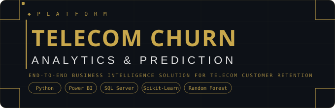

<div align="center">



<br/>


<br/>

**[Dashboard](#dashboard-walkthrough)** &nbsp;·&nbsp; **[ML Model](#machine-learning-model)** &nbsp;·&nbsp; **[Quick Start](#quick-start)** &nbsp;·&nbsp; **[Demo](#demo)**

<br/>

### 6,418 customers &nbsp;·&nbsp; 27% churn rate &nbsp;·&nbsp; 85% model accuracy &nbsp;·&nbsp; 1,655 high-risk customers flagged

</div>

<br/>

---

<br/>

## The Problem

Telecom companies lose billions each year to customer churn — and most of it is preventable. The real challenge isn't *that* customers leave; it's that companies only find out *after* they're gone.

This project closes that gap with a full-stack analytics solution: historical churn analysis that explains *what happened*, and a machine learning engine that identifies *who's about to leave* — before they do.

<br/>

---

<br/>

## What This Project Delivers

<br/>

<div align="center">

| &nbsp;&nbsp;&nbsp;&nbsp;&nbsp;&nbsp;&nbsp;&nbsp;&nbsp;&nbsp;&nbsp;&nbsp;&nbsp;&nbsp; | Capability | Description |
|:---:|:---|:---|
| `01` | **Churn Analysis Dashboard** | Interactive Power BI report analyzing 6,418 customers across demographics, geography, contracts, and services |
| `02` | **Churn Prediction Engine** | Random Forest model (85% accuracy, AUC 0.89) that flags high-risk customers for proactive retention |
| `03` | **SQL Data Pipeline** | Reproducible data preparation using SQL Server views and transformation scripts |
| `04` | **Actionable Segmentation** | Customer-level risk tables operational teams can act on directly |

</div>

<br/>

---

<br/>

## Tech Stack

<div align="center">

| Layer | Tools |
|:---|:---|
| **Data** | SQL Server · SQL Views · ETL Scripts |
| **Analytics** | Python 3.x · Pandas · NumPy · Scikit-Learn · Matplotlib · Seaborn · Jupyter |
| **Presentation** | Power BI Desktop · Power Query · DAX |

</div>

<br/>

---

<br/>

## Repository Structure

```
Churn-Analysis/
│
├── sql/
│   ├── 01_create_tables.sql          # Schema definition — creates stg_Churn and prod_Churn
│   ├── 02_load_data.sql              # Loads CSV, explores data, cleans nulls into prod_Churn
│   └── 03_create_views.sql           # Creates vw_ChurnData and vw_JoinData for Power BI
│
├── data/
│   ├── telecom_customers.csv         # Source dataset — 6,418 customers
│   └── Predictions.csv               # ML model output — consumed by Power BI
│
├── assets/
│   ├── Summary Page.png              # Churn analysis dashboard screenshot
│   ├── Prediction Page.png           # Prediction dashboard screenshot
│   ├── demo.gif                      # Dashboard walkthrough
│   └── banner.svg                    # Repository banner
│
├── churn_model.ipynb                 # ML pipeline — EDA → training → predictions
├── Churn_Dashboard.pbit              # Power BI template file
├── requirements.txt                  # Python dependencies
├── .gitignore                        # Files excluded from version control
├── LICENSE
└── README.md
```

<br/>

---

<br/>

## Quick Start

### Prerequisites

- SQL Server (Express is fine) + SQL Server Management Studio (SSMS)
- Python 3.8+
- Power BI Desktop
- Jupyter Notebook

<br/>

### Step 1 &nbsp;—&nbsp; Clone

```bash
git clone https://github.com/Tushar69k/Churn-Analysis.git
cd Churn-Analysis
```

<br/>

### Step 2 &nbsp;—&nbsp; Set up the database

Open SQL Server Management Studio and run the three scripts **in order**:

```
sql/01_create_tables.sql
sql/02_load_data.sql
sql/03_create_views.sql
```

> **Before running `02_load_data.sql`** — open the file and update the file path on line 20 to point to `telecom_customers.csv` on your machine:
> ```sql
> FROM 'C:\YOUR_PATH\data\telecom_customers.csv'   -- update this
> ```

<br/>

### Step 3 &nbsp;—&nbsp; Install Python dependencies

```bash
pip install -r requirements.txt
```

<br/>

### Step 4 &nbsp;—&nbsp; Run the notebook

```bash
jupyter notebook churn_model.ipynb
```

The notebook reads from `data/telecom_customers.csv`. Run all cells — the final cell exports `data/Predictions.csv`.

<br/>

### Step 5 &nbsp;—&nbsp; Open the dashboard

- Open `Churn_Dashboard.pbit` in Power BI Desktop
- Go to **Home → Transform Data → Data Source Settings**
- Update the SQL Server connection to match your instance
- Click **Refresh**

<br/>

---

<br/>

## Dataset

**Source** &nbsp;—&nbsp; [Telecom Customer Churn · Maven Analytics (Kaggle)](https://www.kaggle.com/datasets/shilongzhuang/telecom-customer-churn-by-maven-analytics)

6,418 customer records across five feature groups:

<br/>

<div align="center">

| Group | Features |
|:---|:---|
| Demographics | `Gender` `Age` `Married` `State` |
| Account | `Number_of_Referrals` `Tenure_in_Months` `Contract` `Payment_Method` |
| Services | `Phone_Service` `Internet_Type` `Online_Security` `Online_Backup` `Device_Protection_Plan` `Streaming_TV` `Streaming_Movies` `Streaming_Music` `Unlimited_Data` `Premium_Tech_Support` |
| Financials | `Monthly_Charge` `Total_Charges` `Total_Refunds` `Total_Long_Distance_Charges` `Total_Revenue` |
| Target | `Customer_Status` → `Stayed` / `Churned` / `Joined` |

</div>

<br/>

> **Churn label:** rows where `Customer_Status = 'Churned'` — 1,732 customers, 27% of total.

<br/>

---

<br/>

## Dashboard Walkthrough

### Page 1 &nbsp;—&nbsp; Churn Analysis Summary


A high-level view of churn behavior across the full customer base.

<br/>

<div align="center">

| Metric | Value |
|:---|:---:|
| Total Customers | **6,418** |
| New Joiners | **411** |
| Total Churned | **1,732** |
| Churn Rate | **27%** |

</div>

<br/>

Key visuals on this page:

- **Churn by gender** — distribution split between male and female customers
- **Churn rate by age group** — older segments show materially higher churn
- **Churn rate by state** — geographic heatmap; several states exceed 50% churn
- **Churn by contract type** — Month-to-Month vs One-Year vs Two-Year
- **Churn by internet type** — Fiber Optic customers churn at significantly higher rates despite being the premium tier
- **Churn by services** — customers without Online Security, Device Protection, or Premium Support churn considerably more
- **Churn category breakdown** — Competitor / Attitude / Dissatisfaction / Price / Other

<br/>

### Page 2 &nbsp;—&nbsp; Churn Prediction Dashboard


Powered by the Random Forest model. **1,655 customers flagged as high churn risk.**

Profiles predicted churners across gender, age, state, contract type, payment method, and tenure — and includes a customer-level risk table for operational teams to act on directly.

<br/>

---

<br/>

## Demo

> Full walkthrough of the Churn Analysis and Prediction dashboards in Power BI.

<div align="center">
  
</div>

<br/>

---

<br/>

## Machine Learning Model

### Pipeline

```
Raw Data  →  Feature Engineering  →  Train / Test Split (80 / 20)
         →  Random Forest Classifier  →  Threshold Tuning
         →  Predictions.csv  →  Power BI
```

<br/>

### Performance

<div align="center">

| Metric | Score |
|:---|:---:|
| Accuracy | 85% |
| Precision | 82% |
| Recall | 62% |
| F1 Score | 70% |
| ROC-AUC | **0.8868** |

</div>

<br/>

> **On recall** — the model correctly identifies ~63% of actual churners. The remaining ~37% are false negatives (missed churners). To increase recall at the cost of precision, lower the classification threshold in the notebook at the cell marked `# THRESHOLD`.

<br/>

### Top 10 Features by Importance

<div align="center">

| Rank | Feature | Importance |
|:---:|:---|:---:|
| 1 | Total Revenue | 0.1424 |
| 2 | Total Charges | 0.1229 |
| 3 | Contract Type | 0.1226 |
| 4 | Monthly Charge | 0.0832 |
| 5 | Total Long Distance Charges | 0.0768 |
| 6 | Age | 0.0672 |
| 7 | Tenure in Months | 0.0466 |
| 8 | State | 0.0407 |
| 9 | Number of Referrals | 0.0392 |
| 10 | Online Security | 0.0351 |

</div>

Full feature importance chart available in `churn_model.ipynb`.

<br/>

---

<br/>

## Key Business Insights

<br/>

**01 &nbsp;—&nbsp; Month-to-Month contracts are the single biggest churn driver**

These customers can leave with no penalty. Incentivizing upgrades to annual contracts — through discounts or bundled perks — is likely the highest-ROI retention lever available.

<br/>

**02 &nbsp;—&nbsp; Fiber Optic customers churn at higher rates than Cable or DSL**

Counterintuitive: premium service users leaving at higher rates suggests a service quality or expectation gap, not a price sensitivity issue. Worth a dedicated investigation before launching generic price-based retention campaigns at this segment.

<br/>

**03 &nbsp;—&nbsp; Value-added services are retention anchors**

Customers without Online Security, Device Protection, or Premium Support churn at significantly higher rates. Bundling these at onboarding — rather than selling them as upsells later — likely improves long-term retention.

<br/>

**04 &nbsp;—&nbsp; The first 12 months are the highest-risk window**

Churn risk drops sharply with tenure. Early-lifecycle engagement and structured onboarding would have an outsized impact on overall churn rates — more so than retention campaigns targeting established customers.

<br/>

**05 &nbsp;—&nbsp; Geographic churn hotspots warrant targeted action**

Several states have churn rates exceeding 50%. Blanket national retention campaigns will underperform; region-specific strategies are needed for these markets.

<br/>

---

<br/>

## Business Impact

<div align="center">

| Area | Value |
|:---|:---|
| Revenue protection | Flag at-risk customers before they cancel, enabling pre-emptive retention offers |
| Targeted campaigns | Segment high-risk customers by contract type, region, and services for precise outreach |
| Onboarding optimization | Use the tenure-churn curve to design better early-lifecycle engagement |
| Service strategy | Fiber Optic churn signal points to product quality issues worth a dedicated investigation |
| Proactive vs. reactive | Shift from reporting on churn that already happened to preventing churn that hasn't |

</div>

<br/>

---

<br/>

## Limitations

- **Static training data** — Churn patterns evolve over time. Periodic retraining is recommended (quarterly at minimum) to prevent model drift.
- **Recall ceiling** — At 62.88% recall, roughly 1 in 3 future churners will not be flagged. Business decisions should account for this miss rate when sizing retention budgets.
- **US-centric dataset** — Geographic features (state-level patterns) are specific to this market. Applying the model to other regions requires retraining on local data.
- **No intervention measurement** — There is no A/B testing framework included. The actual impact of retention offers on flagged customers is not measured here.

<br/>

---

<br/>

## Roadmap

- [ ] Add SHAP values for per-customer churn explainability
- [ ] Build a REST API endpoint for real-time churn scoring
- [ ] Integrate with CRM (Salesforce / HubSpot) for automated retention campaign triggers
- [ ] Automate monthly model retraining pipeline
- [ ] Add cohort analysis to track retention program effectiveness over time

<br/>

---

<br/>

## Author

<div align="center">

**Tushar Kharade** &nbsp;—&nbsp; Data Analyst

*Turning business problems into data-driven solutions.*

<br/>

[](https://www.linkedin.com/in/tushar-kharade-2171b0299)
&nbsp;
[](https://github.com/Tushar69k)
&nbsp;
[](mailto:tushlappy@gmail.com)

</div>

<br/>

---

<br/>

## License

This project is licensed under the [MIT License](LICENSE).  
Dataset sourced from [Kaggle / Maven Analytics](https://www.kaggle.com/datasets/shilongzhuang/telecom-customer-churn-by-maven-analytics) and subject to their terms of use.

<br/>

---

<div align="center">

<br/>

*If this project was useful, a* ★ *on GitHub is always appreciated.*

<br/>

</div>
